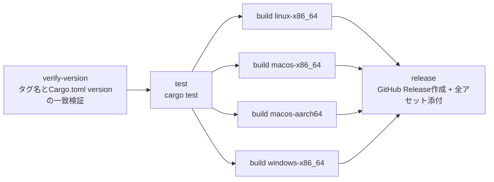

# Infrastructure Design — release-automation

## 概要

`release-automation-requirements.md`のFR-1〜FR-8を実現するGitHub Actionsワークフローの構成。単一ファイル`.github/workflows/release.yml`として実装する。

## ジョブ構成



### verify-version（FR-4対応）
- pushされたタグ名（`refs/tags/vX.Y.Z`）から`X.Y.Z`を抽出
- `cargo metadata`または`Cargo.toml`のパースで`version`フィールドを取得
- 両者が一致しない場合はジョブを失敗させ、以降のジョブを実行しない

### test（FR-5対応）
- `ubuntu-latest`上で`cargo test`を実行
- 失敗時は以降のビルド・リリースジョブを実行しない

### build（FR-3対応、マトリクス戦略）

GitHub-hosted runnerはターゲットにネイティブ対応しているため、`cross`等の追加クロスコンパイルツールは不要（各runnerで`rustup target add`のみで足りる）。

| ターゲット | Runner | target triple |
|---|---|---|
| Linux x86_64 | `ubuntu-latest` | `x86_64-unknown-linux-gnu` |
| macOS x86_64 | `macos-13`（Intel） | `x86_64-apple-darwin` |
| macOS aarch64 | `macos-14`（Apple Silicon） | `aarch64-apple-darwin` |
| Windows x86_64 | `windows-latest` | `x86_64-pc-windows-msvc` |

各ジョブで以下を実施:
1. `dtolnay/rust-toolchain@stable`でツールチェインをセットアップ（`actions-rs/toolchain`は現在メンテナンスされていないため不採用）
2. `cargo build --release --target <triple>`
3. 生成バイナリ（`mustache`／Windowsは`mustache.exe`）をアーカイブ（FR-6: `mustache-<version>-<target-triple>.tar.gz`、Windowsのみ`.zip`）
4. アーカイブを`actions/upload-artifact`でジョブ間受け渡し用に保存

### release（FR-7・FR-8対応）
- 全buildジョブの完了を待つ（`needs: [build-linux, build-macos-x86_64, build-macos-aarch64, build-windows]`）
- `actions/download-artifact`で全アーカイブを収集
- `softprops/action-gh-release`でリリースを作成し、全アーカイブをアセットとして添付
  - `generate_release_notes: true`でGitHub自動生成のリリースノートを使用（FR-8）
  - `actions/create-release`は現在非推奨・メンテナンス終了のため不採用

## 権限（Permissions）

- ワークフローに`permissions: contents: write`を明示的に付与する（リリース作成に必要。GitHub Actionsのデフォルトトークン権限は近年制限的になっているため明示が必須）

## トリガー設定（FR-1・FR-2対応）

```yaml
on:
  push:
    tags:
      - 'v*.*.*'
  workflow_dispatch:
```

## 設計判断まとめ

| 判断事項 | 採用内容 | 理由 |
|---|---|---|
| ツールチェインセットアップ | `dtolnay/rust-toolchain@stable` | デファクトスタンダード、`actions-rs/toolchain`は非メンテナンス |
| クロスコンパイル方式 | GitHub-hostedランナーのネイティブビルド（`cross`不使用） | 対象4ターゲット全てがランナーOSとネイティブに一致するため、追加ツール不要でシンプル |
| リリース作成アクション | `softprops/action-gh-release` | 現行で広く使われ、メンテナンスされている。`actions/create-release`は非推奨 |
| ジョブ分割 | verify-version → test → build（マトリクス） → release | 早期失敗（fail-fast）でムダなビルドを避け、FR-4/FR-5のゲートを構造的に表現 |
| 権限 | `contents: write`を明示付与 | GITHUB_TOKENのデフォルト権限だけではリリース作成に失敗する可能性があるため |
