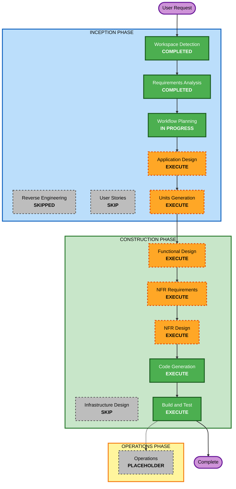

# Execution Plan — rust-mustache-processor

## Detailed Analysis Summary

### Transformation Scope
Greenfield project のため対象外（新規システムの構築）。

### Change Impact Assessment
- **User-facing changes**: Yes — CLIコマンド`mustache`のインターフェース（引数、標準入出力、エラーメッセージ）を新規に設計する
- **Structural changes**: Yes — システムアーキテクチャ全体（パーサー、データモデル、レンダラー、パーシャル解決、CLI層）を新規構築する
- **Data model changes**: Yes — JSON/YAMLを吸収する内部データモデル（Mustacheコンテキスト表現）を新規定義する
- **API changes**: Yes — ライブラリとしての公開API（FR-2）を新規定義する
- **NFR impact**: Yes — 配布形態、テスト方針（公式spec準拠＋PBT）が新規に確立される

### Component Relationships
Greenfield のため既存コンポーネントとの依存関係はなし。新規コンポーネント構成はApplication Designで定義する。

### Risk Assessment
- **Risk Level**: Low — 単一開発者・単一リポジトリで完結し、外部システムとの結合がない
- **Rollback Complexity**: Easy — Gitベースの通常のロールバックで対応可能
- **Testing Complexity**: Moderate — 公式mustache/specコンフォーマンステストとプロパティベーステストの整備が必要

## Workflow Visualization



### Text Alternative

```
INCEPTION PHASE
- Workspace Detection      : COMPLETED
- Reverse Engineering      : SKIPPED (greenfield)
- Requirements Analysis    : COMPLETED
- User Stories             : SKIP
- Workflow Planning        : IN PROGRESS (this document)
- Application Design       : EXECUTE
- Units Generation         : EXECUTE

CONSTRUCTION PHASE (per-unit loop x2 units)
- Functional Design        : EXECUTE
- NFR Requirements         : EXECUTE
- NFR Design                : EXECUTE
- Infrastructure Design    : SKIP
- Code Generation          : EXECUTE (always)
- Build and Test           : EXECUTE (always, after all units)

OPERATIONS PHASE
- Operations               : PLACEHOLDER
```

## Phases to Execute

### 🔵 INCEPTION PHASE
- [x] Workspace Detection (COMPLETED)
- [x] Reverse Engineering (SKIPPED — greenfield、解析対象なし)
- [x] Requirements Analysis (COMPLETED)
- [x] User Stories (SKIPPED)
  - **Rationale**: 単一開発者向けのCLI/ライブラリツールであり、複数のユーザーペルソナやステークホルダー間の合意形成を要するUXシナリオが存在しないため
- [x] Execution Plan (IN PROGRESS)
- [ ] Application Design - **EXECUTE**
  - **Rationale**: パーサー・データモデル（JSON/YAML統合コンテキスト）・レンダラー・パーシャル解決・CLI層という新規コンポーネント群の責務とインターフェースを、実装着手前に明確化する必要があるため
- [ ] Units Generation - **EXECUTE**
  - **Rationale**: FR-2（ライブラリ＋CLIの二層構成）を踏まえ、コアライブラリとCLIラッパーを独立したユニットとして分割し、それぞれ設計・実装できるようにするため

### 🟢 CONSTRUCTION PHASE

**対象ユニット（Application Design / Units Generationで確定させるが、現時点の想定）**:
1. **core-engine**（コアライブラリ: パーサー、データモデル、レンダラー、パーシャル解決、エラーハンドリング）
2. **cli**（CLIバイナリ`mustache`: 引数解析、ファイル/標準入出力制御、core-engine呼び出し）

- [ ] Functional Design - **EXECUTE**（各ユニット）
  - **Rationale**: Mustache仕様の変数展開・セクション・逆セクション・パーシャル解決・デリミタ変更といった業務ロジックの詳細設計、およびPBT-01（テスト可能なプロパティの識別）が必要なため
- [ ] NFR Requirements - **EXECUTE**（各ユニット）
  - **Rationale**: PBTフレームワーク選定（PBT-09、Rust向け`proptest`を想定）、配布形態（シングルバイナリ／クロスプラットフォーム）の技術選定が必要なため
- [ ] NFR Design - **EXECUTE**（各ユニット）
  - **Rationale**: NFR Requirementsで選定したPBTパターン・配布方式を設計に組み込む必要があるため
- [ ] Infrastructure Design - **SKIP**
  - **Rationale**: クラウドインフラやデプロイ先サービスを持たないローカルCLIツールであり、対象となるインフラリソースが存在しないため。クロスプラットフォームビルドの詳細はBuild and Testステージで扱う
- [ ] Code Generation - EXECUTE (ALWAYS)
  - **Rationale**: 各ユニットの実装・テストコード生成が必要
- [ ] Build and Test - EXECUTE (ALWAYS)
  - **Rationale**: 全ユニット結合後のビルド確認、単体/結合テスト、公式specコンフォーマンステスト、PBTの実行手順整備が必要

### 🟡 OPERATIONS PHASE
- [ ] Operations - PLACEHOLDER
  - **Rationale**: 将来のデプロイ・監視ワークフロー用のプレースホルダー（現時点のCLIツールには該当なし）

## Package Change Sequence
Greenfield・単一Cargoパッケージのため対象外。ユニット間の依存関係は「core-engineを先に実装し、cliはcore-engineに依存する」という一方向の関係になる見込み（Units Generationで確定）。

## Estimated Timeline
- **Total Stages**: 9（Application Design, Units Generation, Functional Design×2, NFR Requirements×2, NFR Design×2, Code Generation×2, Build and Test）
- **Estimated Duration**: 目安として中規模の個人開発案件（詳細はUnits Generation確定後に精緻化）

## Success Criteria
- **Primary Goal**: Mustache仕様の必須機能一式に準拠したテンプレート処理エンジンを、ライブラリ＋CLIとして提供する
- **Key Deliverables**:
  - `rust-mustache-processor`ライブラリクレート（core-engine）
  - `mustache`CLIバイナリ
  - 公式mustache/specコンフォーマンステストスイートの統合
  - プロパティベーステスト（PBT）一式
  - 全ソースファイルへの著作権・ライセンスヘッダー
- **Quality Gates**:
  - 公式specの必須モジュール（comments, delimiters, interpolation, inverted, partials, sections）テストが全てパス
  - PBTルール（PBT-01〜PBT-10）準拠
  - `cargo build` / `cargo test`がクリーンに通過
