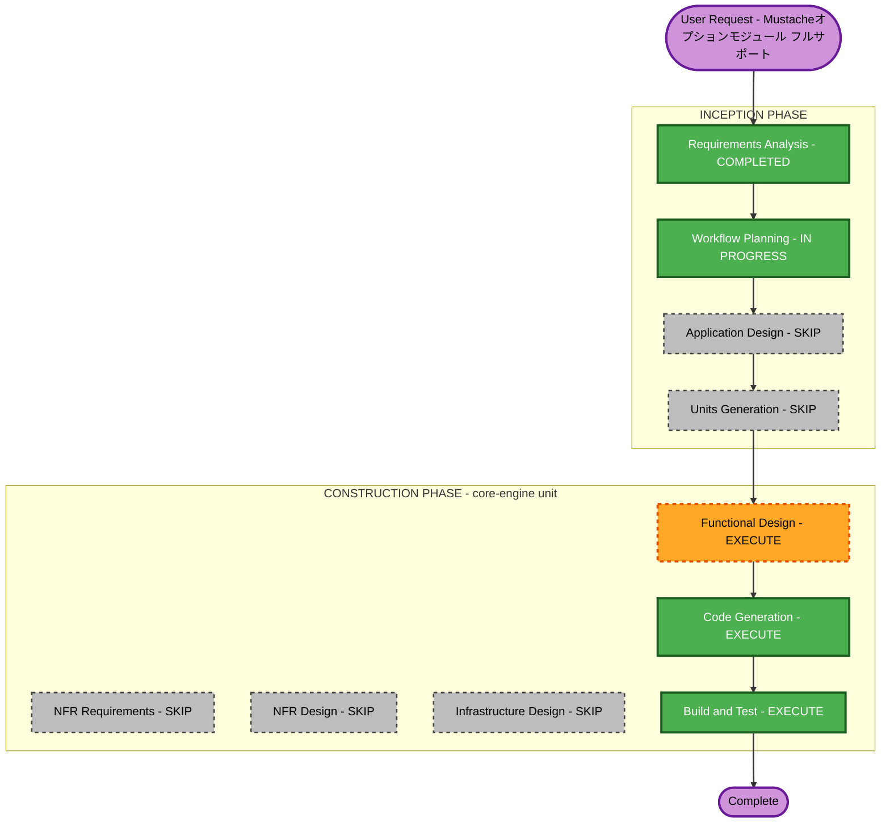

# Execution Plan — Mustacheオプションモジュール フルサポート

## Detailed Analysis Summary

### Transformation Scope
- **Transformation Type**: Single component enhancement（既存`core-engine`ユニットの機能拡張。新規ユニット・新規コンポーネントは追加しない）
- **Primary Changes**: AST（`src/ast.rs`）・パーサー（`src/parser.rs`）・レンダラー（`src/renderer.rs`）・値表現（`src/value.rs`）・エラー型（`src/error.rs`）の拡張、および対応する公式specオプションfixtureの取り込み
- **Related Components**: `cli`ユニット（直接の変更は想定しないが動作確認は必要）、`release-automation`ユニット（影響なし）

### Change Impact Assessment
- **User-facing changes**: Yes — ライブラリAPIに`Value::Lambda`（新バリアント）等が追加される。CLIは新構文（テンプレート継承・動的パーシャル名）を自動的に解釈できるようになるが、新規CLIオプションの追加はない
- **Structural changes**: Yes — AST（`Node`列挙型）に継承・動的パーシャル名対応の新バリアント追加、セクションの生テキスト保持方式の見直しが必要（`mustache-optional-modules-requirements.md`のレビュー時に判明した技術的論点）
- **Data model changes**: Yes — `Value`列挙型への`Lambda`バリアント追加（現行`#[derive(Debug, Clone, PartialEq)]`との非互換を手動実装で解消する必要あり）
- **API changes**: Yes — ライブラリの公開APIに`Value::Lambda`構築手段が追加される（既存APIへの破壊的変更なし、後方互換）
- **NFR impact**: 限定的 — 新規crate追加なし、既存のネスト深度ガード・エラー型の枠組みを流用する想定

### Component Relationships
- **Primary Component**: core-engine（ライブラリ、`mustache_processor`）
- **Dependent Components**: cli（core-engineを利用するのみ。直接のコード変更は想定しないが、Build and Testで動作確認する）
- **Supporting Components**: なし（インフラ・監視等は対象外）

### Risk Assessment
- **Risk Level**: Medium（複数ファイルにまたがる変更だが単一クレート内に閉じている。ASTの生テキスト保持方式やLambdaのtrait設計に技術的未知数がある）
- **Rollback Complexity**: Easy（gitコミット単位でのロールバックが可能、既存公開APIへの破壊的変更なし）
- **Testing Complexity**: Moderate〜Complex（公式spec fixture 3種の追加検証が必要）

## Workflow Visualization

## Phases to Execute

### INCEPTION PHASE
- [x] Requirements Analysis (COMPLETED) — `mustache-optional-modules-requirements.md`
- [x] Workflow Planning (IN PROGRESS) — 本ドキュメント
- [ ] Application Design - SKIP
  - **Rationale**: 新規コンポーネント・新規サービス層は追加しない。既存`core-engine`ユニットの境界内での機能拡張であるため
- [ ] Units Generation - SKIP
  - **Rationale**: 新規ユニットへの分解は不要。既存`core-engine`ユニットをそのまま拡張する

### CONSTRUCTION PHASE（対象ユニット: core-engine）
- [ ] Functional Design - EXECUTE
  - **Rationale**: `Value::Lambda`のデータモデル設計（Debug/Clone/PartialEqの扱い含む）、ラムダ呼び出し規約、テンプレート継承のブロック差し替えアルゴリズム、動的パーシャル名の解決順序など、詳細な業務ロジック設計が必要
- [ ] NFR Requirements - SKIP
  - **Rationale**: 新規crateの追加や新たな性能・セキュリティ・スケーラビリティ要件は発生しない。既存のテストフレームワーク（proptest）・エラー型の枠組みをそのまま利用する
- [ ] NFR Design - SKIP
  - **Rationale**: NFR Requirementsを実行しないため対応するDesignも不要
- [ ] Infrastructure Design - SKIP
  - **Rationale**: クラウドインフラ変更なし（既存プロジェクト全体の方針を継続）
- [ ] Code Generation - EXECUTE (ALWAYS)
  - **Rationale**: AST/パーサー/レンダラー/Value/エラー型の実装、公式spec fixture 3種の追加、テスト実装が必要
- [ ] Build and Test - EXECUTE (ALWAYS)
  - **Rationale**: 公式spec全9モジュール（既存6＋新規3）の100%準拠確認、既存テスト（86テスト実行単位）の非破壊確認、`cargo build --lib --no-default-features`の依存最小化維持確認

### OPERATIONS PHASE
- [ ] Operations - PLACEHOLDER

## Package Change Sequence

単一パッケージ（`rust-mustache-processor`、`core-engine`ユニット）内の変更のみ。`cli`ユニットは動作確認（Build and Test）のみで、直接のコード変更は想定しない。`release-automation`ユニットへの影響はない。

## Estimated Timeline

- **Total Phases**: 3（Functional Design, Code Generation, Build and Test）
- **Estimated Duration**: 時間見積りは行わない（AIアシスト開発のため、セッション内での段階的実施とする）

## Success Criteria

- **Primary Goal**: `~lambdas`・`~inheritance`・`~dynamic-names`の3オプションモジュールを公式spec準拠でフルサポートする
- **Key Deliverables**:
  - 拡張されたAST・パーサー・レンダラー・`Value`・エラー型
  - `tests/spec/fixtures/`への3公式fixture追加とconformanceテスト
  - README.md/README.en.mdのドキュメント更新（新機能・ラムダAPI使用例）
  - バージョン0.2.0としてのリリース
- **Quality Gates**:
  - 公式spec全9モジュール（既存6＋新規3）で100%準拠
  - 既存の全テスト（現行86テスト実行単位）が引き続き成功
  - `cargo build --lib --no-default-features`が新規機能追加後も`serde`系クレートのみに依存し続けることを実測確認
